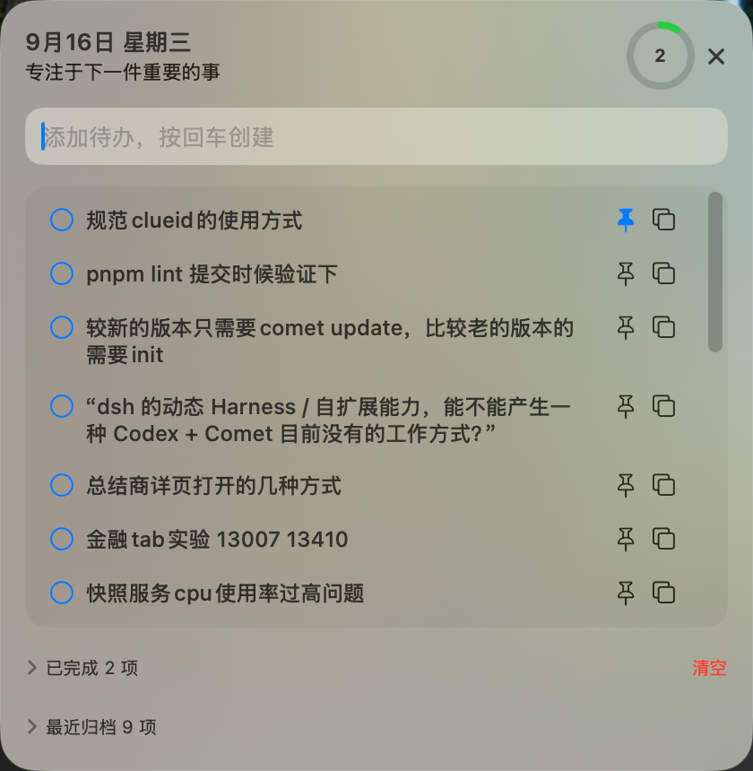

# Flick

快速记下当下想法,贴在刘海旁。

---

## 预览


*收起时显示在刘海右侧,展示置顶任务或任务数量,🐟 emoji 轻微游漂*


*展开后的任务看板: 输入框自动聚焦快速添加,蓝色图钉标记置顶任务,完成与归档任务分组显示*

---

## 它能做什么

- **随时捕捉念头** — 全局快捷键 `⌥ + Enter` 或 `⌥ + Space`,瞬间唤起输入框
- **置顶重要事项** — 将关键任务钉在看板最前,胶囊同步显示
- **本地隐私存储** — 所有数据只保存在这台 Mac 上,无需账号无需联网
- **贴合刘海设计** — 收起时藏在刘海右侧,🐟 emoji 轻微游漂,不占屏幕空间
- **拖拽排序** — 在单栏看板内自由调整任务顺序
- **快捷键操作** — `⌘ + Enter` 完成任务,`Delete` 删除,全程键盘完成
- **截止提醒** — 24 小时内到期显示橙色标记,逾期显示红色
- **自动归档** — 完成任务归档 30 天后自动清理
- **JSON 备份** — 导出/导入所有任务数据

---

## 怎么用

### 日常流程

1. **展开面板** — 按 `⌥ + Enter`(默认) 或点击刘海右侧胶囊
2. **输入想法** — 自动聚焦输入框,输入标题后回车即可创建
3. **管理任务** 
   - 拖拽调整顺序
   - 点击图钉置顶重要任务
   - 设置优先级(低/中/高)和截止日期
   - `⌘ + Enter` 标记完成
4. **收起面板** — 再次按快捷键或点击空白处,胶囊显示最新置顶任务

### 设置选项

在菜单栏图标 → 设置中可以:

- 切换快捷键(`⌥ + Enter` 或 `⌥ + Space`)
- 选择胶囊显示内容(置顶任务标题 或 任务数量)
- 设置自动收起时间(5秒/10秒/30秒,或关闭)
- 多显示器环境下选择面板位置(居中/左侧/右侧)
- 开启/关闭登录启动

---

## 安装

### 下载

从 [GitHub Releases](https://github.com/hottaiger/Flick/releases) 下载最新版本:

```
Flick-{version}-aarch64-mac.zip
```

当前仅支持 **Apple Silicon(M 系列芯片)** 版本。

### 首次打开

由于未经 Apple 公证,macOS 会提示"无法打开":

1. 解压 zip 后,在 Finder 中 **右键点击** `Flick.app`
2. 选择 **"打开"**
3. 在弹窗中再次点击 **"打开"**

若仍提示已损坏,在终端执行(确认来源可信后):

```bash
xattr -dr com.apple.quarantine ~/Downloads/Flick.app
open ~/Downloads/Flick.app
```

*(将路径替换为实际下载位置)*

---

## 系统要求

- macOS 14 Sonoma 或更高版本
- Apple Silicon(M 系列芯片) 或 Intel 处理器

---

## 开发者

### 构建与运行

```bash
# 开发调试
pkill -x Flick; swift run

# 运行测试
swift test

# 构建发布包
zsh scripts/build-app.sh
```

构建产物: `.build/release/Flick.app` 和 `Flick-*-aarch64-mac.zip`

**技术栈**: SwiftUI, SwiftData, AppKit, Swift Package Manager

---

## 许可证

MIT
